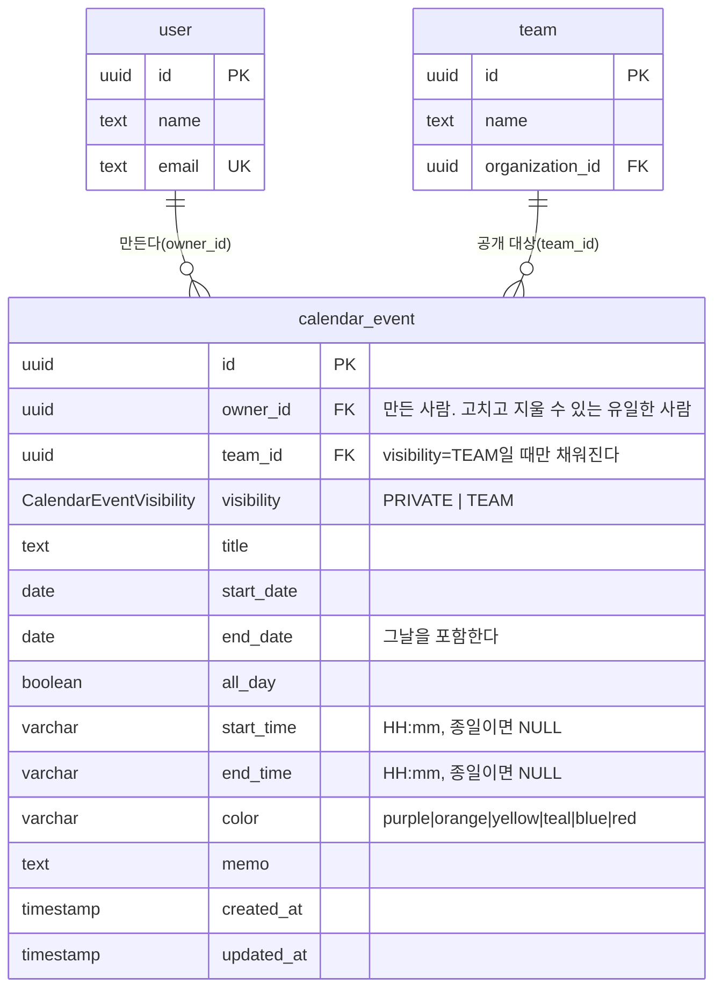

# 일정(Calendar) Database Schema

`backend/prisma/schema.prisma`의 `calendar_event` table에 대한 ERD와 설명이다.
schema·migration을 변경할 때 이 문서도 같은 작업에서 갱신한다 (`AGENTS.md` DB Schema·ERD 동기화 항목).

- Migration: `backend/prisma/migrations/20260825120000_add_calendar_event/`
- 이 table은 사람이 쓰는 값이라 인증 도메인(`user`, `team`)과 같은 규약을 쓴다 —
  PK/FK가 `uuid`이고 column명은 snake_case다. 특허 도메인(`patent*`, PK가 `int`)과는 관계가 없다.

## ERD

## table: calendar_event

대시보드 일정 위젯이 쓰는 **사용자 일정**이다. 특허 라이프사이클 날짜(`patent.application_date` 등)나
`patent_todo`와는 종류가 다르다 — 저쪽은 특허에 딸린 사실이고 이쪽은 사람이 적는 약속이라,
특허와 연결되지 않아도 존재한다.

| column | type | null | 설명 |
| --- | --- | --- | --- |
| `id` | uuid | N | PK |
| `owner_id` | uuid | N | 만든 사람(`user.id`). 삭제되면 일정도 함께 지운다(CASCADE) |
| `team_id` | uuid | Y | 공개 대상 팀(`team.id`). `visibility='PRIVATE'`이면 항상 NULL |
| `visibility` | CalendarEventVisibility | N | `PRIVATE`(기본) 또는 `TEAM` |
| `title` | text | N | 일정 제목. 서버에서 trim하며 빈 값은 거절한다 |
| `start_date` | date | N | 시작일 |
| `end_date` | date | N | 종료일. **그날을 포함**하며 `start_date` 이상이어야 한다 |
| `all_day` | boolean | N | 종일 여부(기본 true) |
| `start_time` / `end_time` | varchar(5) | Y | `HH:mm`. 종일이면 둘 다 NULL, 아니면 둘 다 채워진다 |
| `color` | varchar(20) | N | 화면의 색 표식. 프런트 `CALENDAR_EVENT_COLORS`와 같은 목록 |
| `memo` | text | Y | 메모(최대 300자, 서버 DTO에서 제한) |
| `created_at` / `updated_at` | timestamp | N | 생성·수정 시각 |

### 왜 `date`와 `varchar` 시각인가

달력이 다루는 단위는 "며칠"이다. `timestamp` 하나로 두면 서버·클라이언트 시간대에 따라
같은 값이 하루 밀려 보인다(D-1이 D-Day로 보이는 식). 그래서 날짜는 시각 없는 `date`로 두고,
시각은 그날의 **벽시계 시각**(`09:00`)으로 따로 담는다. 절대 시각이 필요한 종류의 일정
(다른 시간대의 회의)이 생기면 그때 column을 늘려야 한다.

### 조회와 권한

- 목록은 늘 "기간이 겹치는 것"을 묻는다: `start_date <= :to AND end_date >= :from`.
  시작일만 보면 구간 앞에서 시작해 구간 안까지 이어지는 여러 날짜 일정이 빠진다.
- 보이는 범위는 `owner_id = :me OR (visibility = 'TEAM' AND team_id IN :myTeams)`이다.
- **고치고 지우는 것은 `owner_id`만 할 수 있다.** 팀 공개는 '보이는 범위'일 뿐 '고칠 권한'이 아니다.
- index 두 개(`owner_id, start_date, end_date` / `team_id, start_date, end_date`)가 위 두 조건을
  각각 받는다.

### 권한(GRANT) 주의

migration을 소유자 롤로 적용하면 새 table에 앱 롤 권한이 따라오지 않아 런타임에
`permission denied for table calendar_event`가 난다. migration 끝에 기존 table(`team`)의
GRANT를 복사하는 블록이 있다 — `20260820150000_grant_patent_stage_privileges`와 같은 방식이다.
