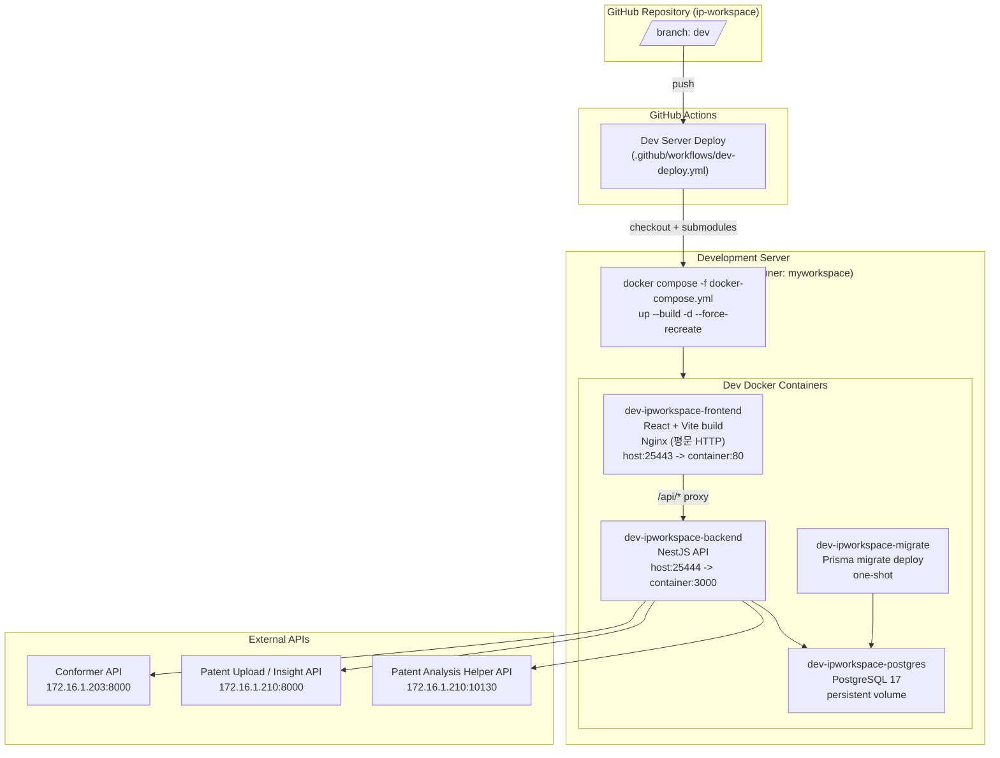

# IP Workspace CI/CD 아키텍처 다이어그램

이 문서는 현재 IP Workspace 프로젝트의 GitHub Actions 기반 개발 서버 배포 흐름과 Docker Compose 서비스 구성을 설명합니다.

현재 확정된 자동 배포는 `dev` 브랜치 대상 개발 서버 배포입니다. 운영 서버 배포 워크플로우와 별도 운영 Compose 파일은 아직 이 저장소에 정의되어 있지 않습니다.

실제 배포 준비, 검증, 장애 대응과 rollback 절차는
[`dev_deployment_runbook.md`](dev_deployment_runbook.md)를 따른다.

## CI/CD 프로세스 다이어그램



## 현재 배포 흐름

1. `dev` 브랜치에 push되면 `.github/workflows/dev-deploy.yml`이 실행됩니다.
2. 워크플로우는 `self-hosted`, `myworkspace` 라벨이 붙은 GitHub Actions runner에서 실행됩니다.
3. `actions/checkout@v4`가 저장소와 submodule을 checkout합니다. submodule 접근에는 `RDKIT_SUBMODULE_TOKEN` secret을 사용합니다.
4. dev 서버의
   `/home/thmoon/devops/myworkspace/secrets/gmail/token.json`을 runner checkout의
   `secrets/gmail/token.json`으로, 같은 위치의 `getMembers.json`을
   `sample/groupware_mail_system/getMembers.json`으로 `600` 권한으로
   복사합니다.
5. runner의 checkout 디렉토리에서 `docker compose -f docker-compose.yml up --build -d --force-recreate`를 실행합니다.
6. 배포 후 `docker image prune -f`로 사용하지 않는 Docker 이미지를 정리합니다.

## Harbor 수동 배포 스크립트

저장소 루트의 `buildAndPush.sh`와 `pullAndStart.sh`는 Compose 서비스 하나와 이미지 태그 하나를 인자로 받는다. 스크립트가 내보내는 `TAG_VERSION`은 `docker-compose.yml`의 애플리케이션 이미지 태그에 반영된다. `TAG_VERSION`을 직접 지정하지 않는 기존 Compose 실행은 `1.0.0`을 기본값으로 사용한다.

| Compose 서비스 | Harbor 이미지 |
| --- | --- |
| `dev-ipworkspace-frontend` | `harbor.dev.voronoi/math2/ip-workspace/web:${TAG_VERSION}` |
| `dev-ipworkspace-backend` | `harbor.dev.voronoi/math2/ip-workspace/backend:${TAG_VERSION}` |
| `dev-ipworkspace-migrate` | `harbor.dev.voronoi/math2/ip-workspace/migrate:${TAG_VERSION}` |

이미지를 빌드하고 Harbor에 push하려면 다음처럼 실행한다.

```bash
./buildAndPush.sh dev-ipworkspace-frontend 20260821
./buildAndPush.sh dev-ipworkspace-backend 20260821
./buildAndPush.sh dev-ipworkspace-migrate 20260821
```

세 서비스를 같은 태그로 함께 처리할 때는 `all`을 사용한다. 빌드·push는 세 애플리케이션 이미지를 한 번에 처리한다.

```bash
./buildAndPush.sh all 20260821
```

배포 서버에서는 같은 태그로 migration, backend, frontend 순서로 pull·기동한다. 각 실행은 선택한 서비스만 중지하고 새 이미지로 강제 재생성하며 다른 Compose 서비스는 내리지 않는다.

```bash
./pullAndStart.sh dev-ipworkspace-migrate 20260821
./pullAndStart.sh dev-ipworkspace-backend 20260821
./pullAndStart.sh dev-ipworkspace-frontend 20260821
```

세 서비스를 한 번에 배포하려면 다음처럼 실행한다. 이 경우 migration 완료를 확인한 뒤 backend와 frontend를 순서대로 기동한다.

```bash
./pullAndStart.sh all 20260821
```

두 스크립트 모두 Harbor 인증이 필요하면 실행 전에 `docker login harbor.dev.voronoi`를 완료해야 한다. `COMPOSE_FILE` 환경변수로 다른 Compose 파일을 선택할 수 있다.

## 개발 서버 컨테이너 구성

| 서비스 | 컨테이너 | 역할 | 포트 |
| --- | --- | --- | --- |
| Frontend | `dev-ipworkspace-frontend` | React/Vite 빌드 결과를 Nginx로 서빙하고 내부 API 경로를 proxy | `25443:80` |
| Backend | `dev-ipworkspace-backend` | NestJS API 서버 | `25444:3000` |
| Migration | `dev-ipworkspace-migrate` | Backend 시작 전 Prisma migration 적용 | 내부 전용, one-shot |
| PostgreSQL | `dev-ipworkspace-postgres` | Better Auth 사용자·Account·Session·감사 로그 영속 저장 | 내부 전용 |

RDKit API와 Compound Search API 컨테이너는 dev 배포 구성에서 제거되었습니다. 두 서비스는 로컬 개발용 `docker-compose.yml_local`에만 남아 있습니다.

Frontend Nginx는 TLS를 직접 종단하지 않고 평문 HTTP만 서빙합니다. HTTPS가 필요한 경우 앞단 reverse proxy에서 종단합니다.

## Base path (`/ip-workspace/`)

서비스는 앞단 nginx에서 path 기반으로 라우팅됩니다.

```nginx
location /ip-workspace/ {
    proxy_pass http://172.16.1.183:25443/;
}
```

`proxy_pass` 끝의 `/` 때문에 prefix는 벗겨진 채 컨테이너로 전달됩니다. 즉 **컨테이너 안의 nginx와 backend는 계속 `/`, `/api/...`를 받고**, prefix를 알아야 하는 쪽은 브라우저가 보는 URL을 만드는 프론트엔드뿐입니다.

prefix의 단일 출처는 빌드 인자 `BASE_PATH`(기본 `/ip-workspace/`)입니다.

| 위치 | 사용 방식 |
| --- | --- |
| `frontend/Dockerfile.dev` | `ARG BASE_PATH` → 빌드 시 env로 전달 |
| `frontend/vite.config.ts` | `base: BASE_PATH`. dev 서버 proxy 규칙도 같은 prefix로 매칭하고 target에 넘길 때 벗김 |
| `frontend/src/config/basePath.ts` | `import.meta.env.BASE_URL`을 읽어 `withBasePath()`와 API 기본 경로 상수를 제공 |
| `src/App.tsx` | react-router `basename` |
| `docker-compose.yml` | `build.args.BASE_PATH`와 `VITE_*_URL` 값에 동일 변수 사용 |

prefix 없이 루트로 배포하려면 `BASE_PATH=/`를 지정하면 됩니다. 이 경우 basename은 빈 문자열이 되고 모든 경로가 기존과 동일해집니다.

Backend는 prefix를 인식하지 않습니다. Better Auth의 `basePath`는 prefix가 벗겨진 뒤의 `/api/auth`가 맞고, `trustedOrigins`/`CORS_ORIGINS`는 origin만 비교하므로 path의 영향을 받지 않습니다.

## Frontend Proxy 경로

`frontend/nginx.conf` 기준으로 프론트엔드 컨테이너는 다음 경로를 내부 서비스로 전달합니다.

| 외부 경로 | 내부 대상 |
| --- | --- |
| `/api/*` | `http://dev-ipworkspace-backend:3000/api/*` |
| `/api/servers`, `/api/status/*`, `/api/notices/*`, `/monitoring/*` 등 | `${MONITORING_PROXY_TARGET}` (기본 `http://172.16.1.200:2026`) |

`/rdkit-api/*`와 `/compound-search-api/*` proxy는 해당 서비스 제거와 함께 삭제되었습니다. 프론트엔드 코드는 여전히 두 경로를 호출하므로, dev 환경에서 구조 렌더링·화합물 검색 기능은 동작하지 않습니다.

## 외부 연동

Backend 컨테이너는 `docker-compose.yml`의 환경변수로 외부 API 주소를 주입받습니다.

| 환경변수 | 기본 개발 서버 값 | 용도 |
| --- | --- | --- |
| `PATENT_ANALYSIS_HELPER_API_URL` | `http://172.16.1.210:10130` | 특허 분석 helper API |
| `PATENT_ANALYSIS_UPLOAD_API_URL` | `http://172.16.1.210:8000` | 특허 분석 업로드 API |
| `PATENT_INSIGHT_API_URL` | `http://172.16.1.210:8000` | Patent Insight API |
| `SEAWEEDFS_FILER_URL` | `http://172.16.1.183:8888` | SeaweedFS 쓰기·삭제 Filer URL |
| `SEAWEEDFS_PUBLIC_URL` | `http://172.16.1.183:8888` | Backend 이미지 조회에 사용할 Filer URL |
| `SEAWEEDFS_BASE_PATH` | 빈 값 | 환경 디렉터리 아래의 선택적 추가 경로 |
| `SEAWEEDFS_ROOT_DIR` | `buckets` | SeaweedFS 최상위 디렉터리 |
| `SEAWEEDFS_ENV_DIR` | `ip_ws_dev` | 배포 환경별 저장 디렉터리 |
| `CONFORMER_API_URL` | `http://172.16.1.203:8000` | conformer 생성 API |
| `VPROP_API_URL` | `http://172.16.1.207:8100` | Vprop 물성 예측 API |
| `VPROP_API_TIMEOUT_MS` | `25000` | Vprop 동기 계산 timeout |
| `VPROP_MAX_RESPONSE_BYTES` | `5242880` | Vprop 응답 최대 크기 |
| `GROUPWARE_LOGIN_CHECK_URL` | `http://172.16.1.32:10050/login_check` | Groupware Token 검증 |
| `GROUPWARE_REVALIDATE_INTERVAL_SECONDS` | `600` | Groupware Token 10분 재검증 |

개발 배포에는 GitHub Environment secret `POSTGRES_PASSWORD`, `BETTER_AUTH_SECRETS`가 필수다. `BETTER_AUTH_SECRETS`는 `version:32자 이상 secret` 형식을 사용하며 기존 배포 후에는 같은 값을 유지해야 기존 암호화 Token과 session을 계속 사용할 수 있다.

Gmail OAuth token은 GitHub Secret이나 image에 넣지 않는다. self-hosted runner가
dev 서버의 `/home/thmoon/devops/myworkspace/secrets/gmail/token.json`을 checkout
내부로 복사하고, Compose가 Backend의 `/run/secrets/gmail/token.json`에
read-only bind mount한다. source 파일이 없으면 배포는 container build 전에
실패한다.

그룹웨어 구성원 원본도 Git에 넣지 않는다. 같은 host 디렉터리의
`getMembers.json`을 checkout의
`sample/groupware_mail_system/getMembers.json`으로 복사하고 Backend의
`/app/imports/groupware-members/getMembers.json`에 read-only mount한다.

## 아직 미정인 영역

- 운영 배포용 GitHub Actions workflow는 현재 없습니다.
- 운영 배포용 `docker-compose.prod.yml`은 현재 없습니다.
- Redis와 Worker 컨테이너는 현재 `docker-compose.yml`에 포함되어 있지 않습니다.
- 로컬 개발용 `docker-compose.yml_local`은 개발 서버 배포 파일과 별도로 존재하며, 서비스 prefix(`local-ipworkspace-*`), 포트, 일부 환경변수가 다릅니다.
