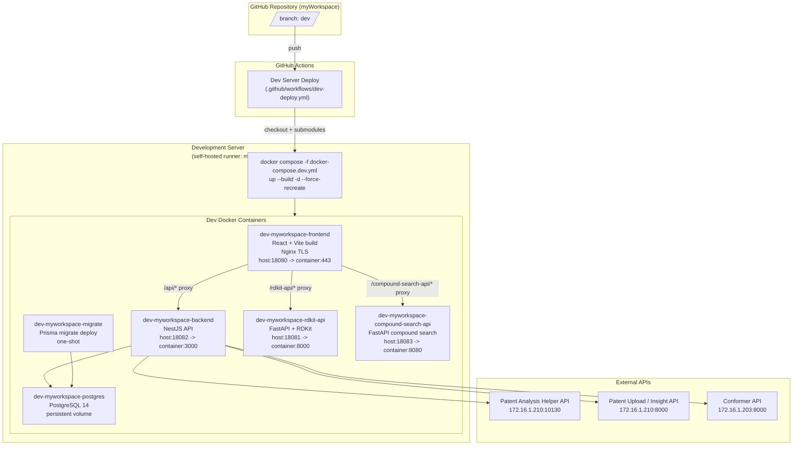

# MyWorkspace CI/CD 아키텍처 다이어그램

이 문서는 현재 MyWorkspace 프로젝트의 GitHub Actions 기반 개발 서버 배포 흐름과 Docker Compose 서비스 구성을 설명합니다.

현재 확정된 자동 배포는 `dev` 브랜치 대상 개발 서버 배포입니다. 운영 서버 배포 워크플로우와 별도 운영 Compose 파일은 아직 이 저장소에 정의되어 있지 않습니다.

## CI/CD 프로세스 다이어그램

## 현재 배포 흐름

1. `dev` 브랜치에 push되면 `.github/workflows/dev-deploy.yml`이 실행됩니다.
2. 워크플로우는 `self-hosted`, `myworkspace` 라벨이 붙은 GitHub Actions runner에서 실행됩니다.
3. `actions/checkout@v4`가 저장소와 submodule을 checkout합니다. submodule 접근에는 `RDKIT_SUBMODULE_TOKEN` secret을 사용합니다.
4. runner의 checkout 디렉토리에서 `docker compose -f docker-compose.dev.yml up --build -d --force-recreate`를 실행합니다.
5. 배포 후 `docker image prune -f`로 사용하지 않는 Docker 이미지를 정리합니다.

## 개발 서버 컨테이너 구성

| 서비스 | 컨테이너 | 역할 | 포트 |
| --- | --- | --- | --- |
| Frontend | `dev-myworkspace-frontend` | React/Vite 빌드 결과를 TLS Nginx로 서빙하고 내부 API 경로를 proxy | `18080:443` |
| Backend | `dev-myworkspace-backend` | NestJS API 서버 | `18082:3000` |
| Migration | `dev-myworkspace-migrate` | Backend 시작 전 Prisma migration 적용 | 내부 전용, one-shot |
| PostgreSQL | `dev-myworkspace-postgres` | Better Auth 사용자·Account·Session·감사 로그 영속 저장 | 내부 전용 |
| RDKit API | `dev-myworkspace-rdkit-api` | RDKit 기반 구조 처리 FastAPI | `18081:8000` |
| Compound Search API | `dev-myworkspace-compound-search-api` | 화합물 검색 FastAPI | `18083:8080` |

## Frontend Proxy 경로

`frontend/nginx.conf` 기준으로 프론트엔드 컨테이너는 다음 경로를 내부 서비스로 전달합니다.

| 외부 경로 | 내부 대상 |
| --- | --- |
| `/api/*` | `http://dev-myworkspace-backend:3000/api/*` |
| `/rdkit-api/*` | `http://dev-myworkspace-rdkit-api:8000/*` |
| `/compound-search-api/*` | `http://dev-myworkspace-compound-search-api:8080/*` |

## 외부 연동

Backend 컨테이너는 `docker-compose.dev.yml`의 환경변수로 외부 API 주소를 주입받습니다.

| 환경변수 | 기본 개발 서버 값 | 용도 |
| --- | --- | --- |
| `PATENT_ANALYSIS_HELPER_API_URL` | `http://172.16.1.210:10130` | 특허 분석 helper API |
| `PATENT_ANALYSIS_UPLOAD_API_URL` | `http://172.16.1.210:8000` | 특허 분석 업로드 API |
| `PATENT_INSIGHT_API_URL` | `http://172.16.1.210:8000` | Patent Insight API |
| `CONFORMER_API_URL` | `http://172.16.1.203:8000` | conformer 생성 API |
| `VPROP_API_URL` | `http://172.16.1.207:8100` | Vprop 물성 예측 API |
| `VPROP_API_TIMEOUT_MS` | `25000` | Vprop 동기 계산 timeout |
| `VPROP_MAX_RESPONSE_BYTES` | `5242880` | Vprop 응답 최대 크기 |
| `GROUPWARE_LOGIN_CHECK_URL` | `http://172.16.1.32:10050/login_check` | Groupware Token 검증 |
| `GROUPWARE_REVALIDATE_INTERVAL_SECONDS` | `600` | Groupware Token 10분 재검증 |

개발 배포에는 GitHub Environment secret `POSTGRES_PASSWORD`, `BETTER_AUTH_SECRETS`가 필수다. `BETTER_AUTH_SECRETS`는 `version:32자 이상 secret` 형식을 사용하며 기존 배포 후에는 같은 값을 유지해야 기존 암호화 Token과 session을 계속 사용할 수 있다.

## 아직 미정인 영역

- 운영 배포용 GitHub Actions workflow는 현재 없습니다.
- 운영 배포용 `docker-compose.prod.yml`은 현재 없습니다.
- Redis와 Worker 컨테이너는 현재 `docker-compose.dev.yml`에 포함되어 있지 않습니다.
- 로컬 개발용 `docker-compose.yml`은 개발 서버 배포 파일과 별도로 존재하며, 포트와 일부 환경변수가 다릅니다.
