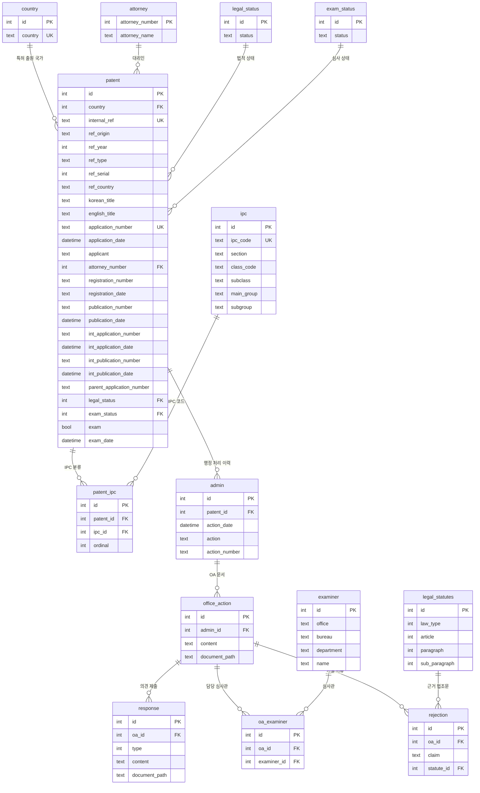

# 특허 도메인 Database Schema

`backend/prisma/schema.prisma`의 특허 도메인 14개 table에 대한 ERD와 table 설명이다.
schema·migration을 변경할 때 이 문서도 같은 작업에서 갱신한다 (`AGENTS.md` DB Schema·ERD 동기화 항목).

- Migration: `backend/prisma/migrations/20260810120000_add_patent_domain/`,
  `backend/prisma/migrations/20260810160000_add_patent_internal_ref/`
- 이 묶음은 외부 특허 데이터를 적재하는 용도라 PK/FK가 `int`이고 column명이 snake_case다.
  기존 auth 도메인(uuid PK, camelCase column)과 규칙이 다르다.

## ERD



## Table 설명

| table | Prisma model | 설명 |
| --- | --- | --- |
| `country` | `Country` | 출원 국가 코드. `country`에 unique. |
| `attorney` | `Attorney` | 대리인. PK가 외부 시스템의 `attorney_number`라 autoincrement를 쓰지 않는다. |
| `legal_status` | `LegalStatus` | 특허의 법적 상태 코드 테이블. |
| `exam_status` | `ExamStatus` | 특허의 심사 상태 코드 테이블. |
| `patent` | `Patent` | 특허 본체. `application_number`에 unique. 국내·국제 출원/공개 번호와 일자를 함께 보관한다. IP팀 내부관리번호는 `internal_ref`(원문, unique)에 두고 `ref_*`에 파싱 결과를 함께 저장한다. |
| `ipc` | `Ipc` | IPC 분류 코드. `ipc_code`에 unique이며 section·class·subclass·group으로 분해해 둔다. |
| `patent_ipc` | `PatentIpc` | 특허와 IPC의 N:M 연결. `ordinal`로 표기 순서를 유지한다. |
| `admin` | `PatentAdmin` | 특허별 행정 처리 이력. 사용자 관리(`AdminModule`)와 무관하다. |
| `office_action` | `OfficeAction` | 행정 처리에 딸린 OA 문서. |
| `response` | `OfficeActionResponse` | OA에 대한 의견 제출/보정. `type`으로 종류를 구분한다. |
| `examiner` | `Examiner` | 심사관. 소속 청·국·부서를 보관한다. |
| `oa_examiner` | `OaExaminer` | OA와 심사관의 N:M 연결. |
| `legal_statutes` | `LegalStatute` | 법조문. 법종류·조·항·호로 분해해 둔다. |
| `rejection` | `Rejection` | OA의 거절 이유. 대상 청구항(`claim`)과 근거 법조문을 연결한다. |

## 내부관리번호 (`internal_ref`)

IP팀이 자체 운영하는 식별자다. 원문(`internal_ref`)이 정본이고, `ref_*`는 저장 시점에
파싱해 채우는 파생 컬럼이다. 파싱 로직은 `backend/src/patent-record/internal-ref.ts`에 있다.

```
A 25 0 001        A250001     당사 기초출원
A 25 P 001        A25P001     우선권주장
A 25 W 001        A25W001     PCT
L 18 Y 001        L18Y001     License-in
F 25 W 001 US     F25W001US   미국 진입
│  │  │  │   └─ ref_country  국가 2자 (선택)
│  │  │  └────── ref_serial   일련번호 3자
│  │  └───────── ref_type     유형 1자   0 기초 / P 우선권 / W PCT / Y (미확인)
│  └──────────── ref_year     연도 2자 → 4자리로 확장해 저장 (2000 + yy)
└─────────────── ref_origin   출처 1자   A 당사 / L License-in / F US 기반
```

**형식을 강제하지 않는다.** 규칙에 맞지 않는 값도 원문 그대로 저장하고 `ref_*`만 비워 둔다.
`L18Y001`의 `Y`처럼 아직 정의되지 않은 값이 이미 존재하고, 시트 마이그레이션에서 더 나올
것으로 보기 때문이다. 실데이터를 확보한 뒤 규칙을 확정하는 것이 다음 단계다.
목록 화면은 `ref_origin`이 비어 있는 행에 "규칙 외" 배지를 붙여 정리 대상을 드러낸다.

입력값은 대문자로 정규화해 저장한다(`a250001` → `A250001`). 대소문자만 다른 중복을 막기 위함이다.

## 제약 조건

### Unique

| 대상 | 근거 |
| --- | --- |
| `country.country` | ERD 표기 |
| `patent.application_number` | ERD 표기 |
| `patent.internal_ref` | ERD에 없음. IP팀 내부관리번호는 건별 고유해야 하므로 추가함 |
| `ipc.ipc_code` | ERD에 없음. 코드가 분해 column들의 원본이라 중복될 수 없어 추가함 |
| `patent_ipc(patent_id, ipc_id)` | ERD에 없음. 같은 특허에 동일 IPC가 중복 연결되지 않도록 추가함 |
| `oa_examiner(oa_id, examiner_id)` | ERD에 없음. 같은 OA에 동일 심사관이 중복 연결되지 않도록 추가함 |

### NOT NULL

PK 외에 `country.country`, `legal_status.status`, `exam_status.status`, `ipc.ipc_code`,
`examiner.name`, `patent.application_number`, `patent.country`, `patent_ipc.ordinal`,
그리고 소유 관계를 이루는 FK(`patent_ipc.patent_id`, `patent_ipc.ipc_id`, `admin.patent_id`,
`office_action.admin_id`, `response.oa_id`, `oa_examiner.oa_id`, `oa_examiner.examiner_id`,
`rejection.oa_id`)가 NOT NULL이다. 나머지는 모두 nullable이다.

### onDelete

- 소유 관계(`patent → admin → office_action → response`/`rejection`, `patent_ipc`, `oa_examiner`)는 `Cascade`.
- 조회용 참조(`patent.attorney_number`, `patent.legal_status`, `patent.exam_status`, `rejection.statute_id`)는 `SetNull`.
- `patent.country`는 NOT NULL이라 기본값인 `Restrict`. 참조 중인 국가는 삭제되지 않는다.
